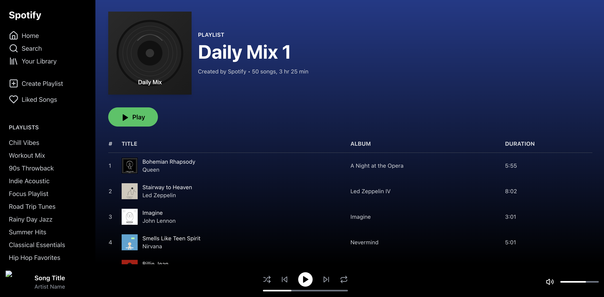

# Spotify UI Clone Challenge

## Challenge Overview

In this coding challenge, you will create a pixel-perfect clone of the Spotify user interface as shown in the demo image below:



Your task is to recreate this interface using Next.js, React, and appropriate styling techniques. This challenge will test your frontend development skills, attention to detail, and ability to implement modern UI designs.

## Getting Started

1. Install dependencies:

```bash
npm install
# or
yarn install
# or
pnpm install
# or
bun install
```

2. Run the development server:

```bash
npm run dev
# or
yarn dev
# or
pnpm dev
# or
bun dev
```

4. Open [http://localhost:3000](http://localhost:3000) with your browser to see your implementation.

## Challenge Requirements

Your implementation should:

- Match the layout, colors, and spacing shown in the demo image
- Include all UI elements (sidebar, playlist header, song list, playback controls)
- Use appropriate hover states for interactive elements
- Ensure proper alignment of all elements
- Use the provided SVG assets in the public folder

## Technical Requirements

- Implement with TypeScript
- Use tailwindcss for styling
- Create reusable components where appropriate
- Follow best practices for accessibility
- Ensure clean, well-organized code structure

## Evaluation Criteria

Your submission will be evaluated based on:

- Visual accuracy compared to the demo image
- Code quality and organization
- Component architecture
- Attention to detail

## Assets

All necessary icons and images are provided in the `public` directory of this repository.
